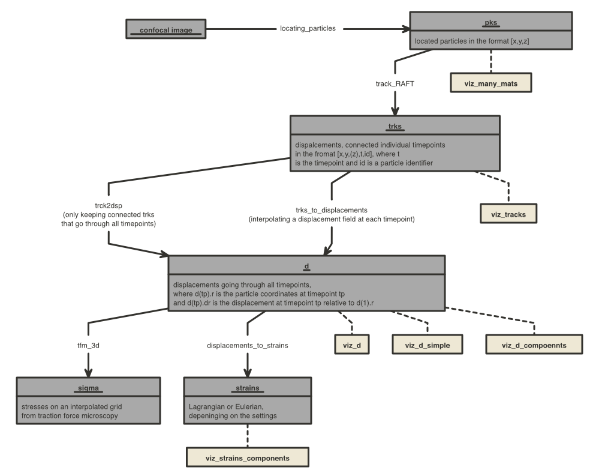

# confocal_microscopy_code_repository
Collection of MATLAB codes useful for locating and tracking particles in confocal microscopy images.

# Code overview
 
 

# Acknowledgement
- Rob Style and Nicolas Bain partially wrote some of the codes given here and helped with the development of many.
- [track_RAFT.m](https://zenodo.org/record/4884065) has been written by Rob Style and was adapted here by Dominic Gerber.
- trck2dsp.m has been written by Rostislav Boltyanskiy and Eric Dufresne. track2disp.m has been written by Eric Dufresne.
- calcQ.m has been written by Ye Xu.
- delete_bad_vectors_3d.m has been written by Callen Hyland, Guy German and has been adapted by Dominic Gerber.

## Dependencies
- This repository uses the excellent [export_fig](https://github.com/altmany/export_fig) by [Yair Altman](https://github.com/altmany) and [Oliver J. Woodford](https://github.com/ojwoodford) to save images. A local copy is given here for reproducibility.
- For coloring plots we used [cbrewer2](https://github.com/scottclowe/cbrewer2) by [Scott Lowe](https://github.com/scottclowe). A local copy is given here for reproducibility.	
